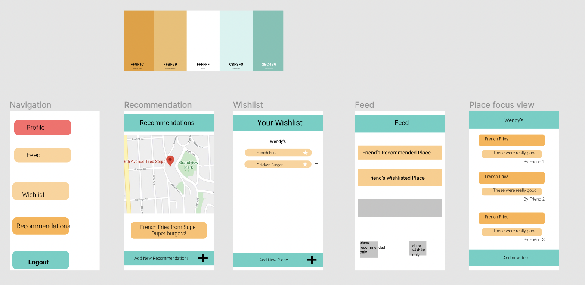
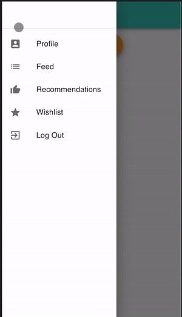

# ShareEats

Created for TechTogether Boston 

### Team
Sharon, Ojal, Jessica

### General Info
This is mobile friendly web application which allows users to log in and then add places to their wishlist. 

#### Project name

ShareEats

#### Elevator pitch

Ever passed a restaurant you wanted to try but it never came to mind when you actually wanted to eat? Ever wanted to have a meal with a friend and wanted to bring them to a place they've always wanted to go? Ever find yourself staring at the restaurant search on Google Maps and couldn't remember which restaurant your friend recommended? ShareEats can help with that!

### Project Story

#### About the project

Because we all love food and hanging out with friends, we wanted to make a platform that would bring together friends and food. We settled on the idea of a social network revolving around restaurant wishlists. We planned features that would utilize Google Maps API to display restaurants nearby, easily add restaurants to a wishlist, and view restaurants wishlisted and recommended by friends.

We decided at the beginning that this project should be a way for us to explore technologies and services we haven't used before or wanted to explore more in depth. This is the way we chose our technology stack, with a frontend utilizing React and Material UI and a backend supported by Node.js, Express.js, and a MySQL database. We also wanted to test deploying our full stack web app to Microsoft Azure cloud services, as well as utilize Auth0 as our user authentication feature.

On the frontend side, we learned how to setup login with Auth0, utilize React Router and Material-UI to build a functional Drawer Sheet-styled navigation menu, use the useEffect hook to fetch and initialize data from the Node.js server api, and then deploy a basic web app on Microsoft Azure services. On the backend side, we learned how to setup a Express.js server, customize API routes, create and connect to a MySQL database server, and query the database to get and post items using a frontend connected to the Express.js API paths.

We ran into many technical challenges along the way, because we decided to tackle areas we weren't very familiar with. Our primary challenge was figuring out how to set up MySQL on the server-side and make that database setup accessible to everyone on the team. We had many questions, such as whether that database should be created locally or if we should utilize Microsoft Azure to support a remote database. Another challenge was figuring out how to use Microsoft Azure's Github Actions to deploy our combined frontend and backend together. We received a lot of help from the Microsoft mentors about how to work with Azure and ended up deploying just the React app to the frontend through the VS wizard for creating static web apps. We also sought help for deploying our Node.js server and MySQL database server separately on Microsoft Azure and we are still working on it up until project submission deadline.

Even though we did not finish a workable prototype, we're really proud of what we managed to accomplish. From having no backend or database experience at all, we managed to set up a Node.js server with a separate MySQL server from scratch, connect it with a React frontend, and deploy parts of it onto Microsoft Azure. We came into this project with a goal of using technology we don't usually have the opportunity to use and we ended up learning a lot and gaining confidence in using these technologies in the future.

#### Built with

React and Material UI for the fronted, Node.js with Express.js for the backend and MySQL for the database. Microsoft Azure for deploying the React app, Node.js server, and MySQL database separately on the cloud, and Auth0 for authentication.

### "Try it out" links

[React app deployed to Microsoft Azure](https://delightful-bay-053c4ed0f.azurestaticapps.net/)

[Github](https://github.com/ojalmaps/food-hack)

### Project Media

#### Image Gallery

#### Video demo link
